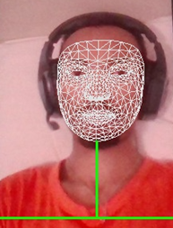

# An Open-Source AI-Based Facial Recognition Attendance System using Mediapipe, YOLOv8 and DeepFace

This is an open-source facial recognition attendance system built using Python.

Pictures shows the way of detection of faces with  mediapipe for automation.
## Features
- Facial detection and recognition
- Attendance tracking
- User registration with photo
- SQLite database integration
-Environment monitoring

## Installation

1. Clone the repository:
git clone https://github.com/Shegaw-tech/facial-recognition-attendance-system.git
2. Navigate to the project directory: cd facial-recognition-attendance-system

3. Install dependencies:pip install -r requirements.txt

4. Run the app:python app.py
5. app.config['ADMIN_PASSWORD'] = '123'   ## this can be configured during installation
6. http://127.0.0.1:5000/tracking  ## normal tracking 
7. http://127.0.0.1:5000/tracking?password=123  ## admin tracking
## Contributing

Pull requests are welcome! For major changes, open an issue first.

## License

[GPL](LICENSE)

